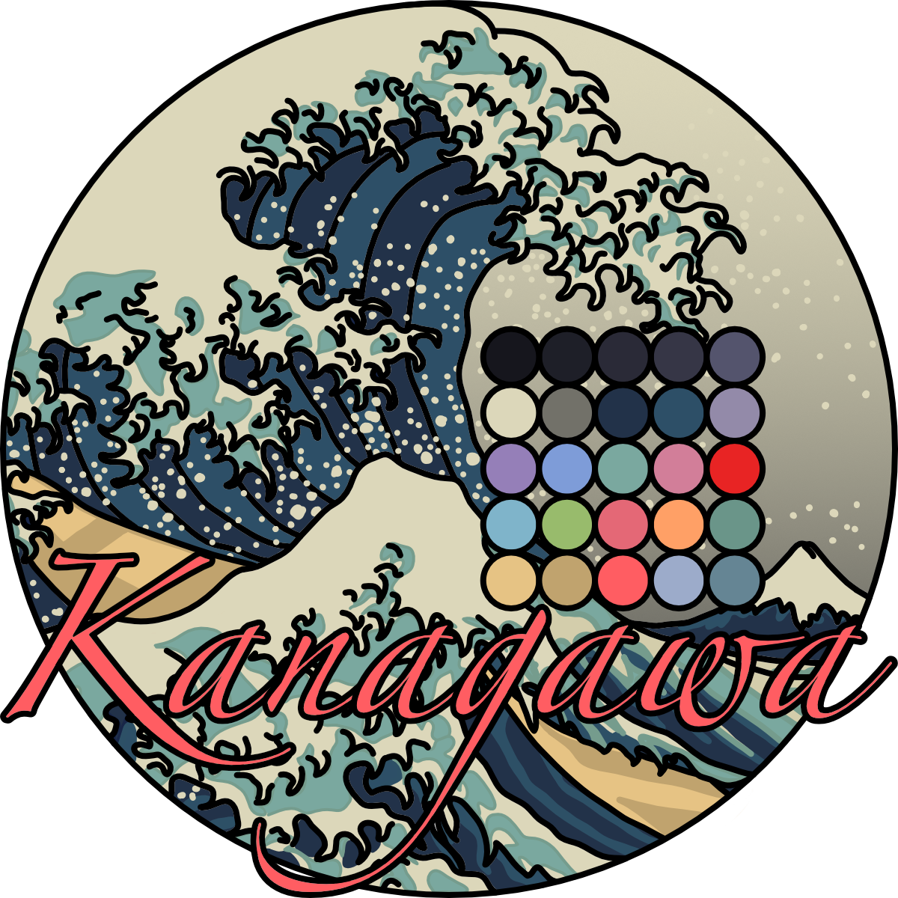

<h2 align="center">Kanagawa CodeMirror Color Theme</h2>

<div align="center">
  
</div>

A port of the beautiful Kanagawa Neovim color theme, including all three flavors `Wave`, `Dragon` and `Lotus`.

<div align="center">
  <h3>Wave</h3>
  
</div>

<div align="center">
  <h3>Dragon</h3>
  
</div>

<div align="center">
  <h3>Lotus</h3>
  
</div>

## API and usage

All three flavors expose the same API.

### Enable both the editor theme and the highlight style

```ts
kanagawaWave: Extension;
kanagawaDragon: Extension;
kanagawaLotus: Extension;
```

```js
import { kanagawaWave } from 'kanagawa-codemirror-theme';

new EditorView({
  state: EditorState.create({
    extensions: [kanagawaWave, ...]
    ...
  });
  ...
});
```

### Enable just the editor theme:

```ts
kanagawaWaveTheme: Extension;
kanagawaDragonTheme: Extension;
kanagawaLotusTheme: Extension;
```

```js
import { kanagawaWaveTheme } from 'kanagawa-codemirror-theme';

new EditorView({
  state: EditorState.create({
    extensions: [kanagawaWaveTheme, ...]
    ...
  });
  ...
});
```

### Enable just the highlight style:

```ts
kanagawaWaveHighlightStyle: HighlightStyle;
kanagawaDragonHighlightStyle: HighlightStyle;
kanagawaLotusHighlightStyle: HighlightStyle;
```

```js
import { syntaxHighlighting } from "@codemirror/language";
import { kanagawaWaveHighlightStyle } from 'kanagawa-codemirror-theme';

new EditorView({
  state: EditorState.create({
    extensions: [syntaxHighlighting(kanagawaWaveHighlightStyle), ...]
    ...
  });
  ...
});
```

Credits to [rebelot](https://github.com/rebelot/kanagawa.nvim) for the original Neovim theme.

## License

This project is licensed under the MIT License - see the [LICENSE](LICENSE) file for details.
